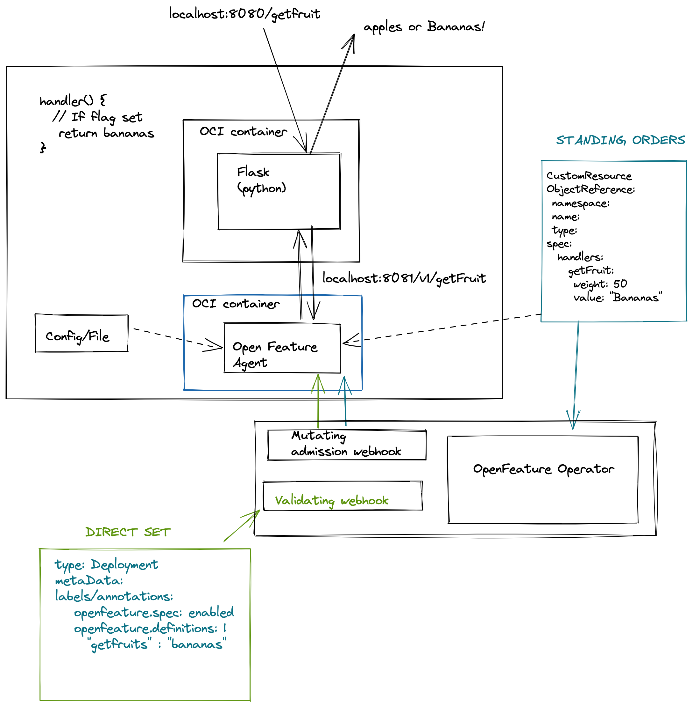
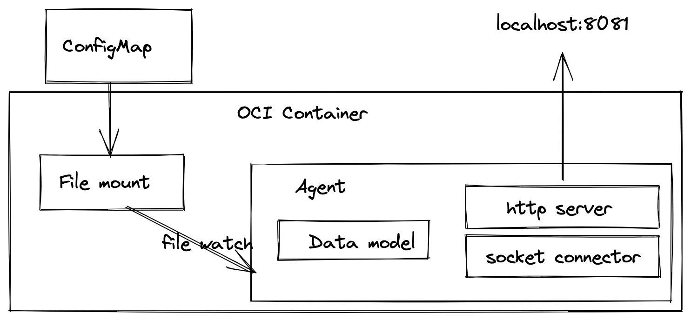
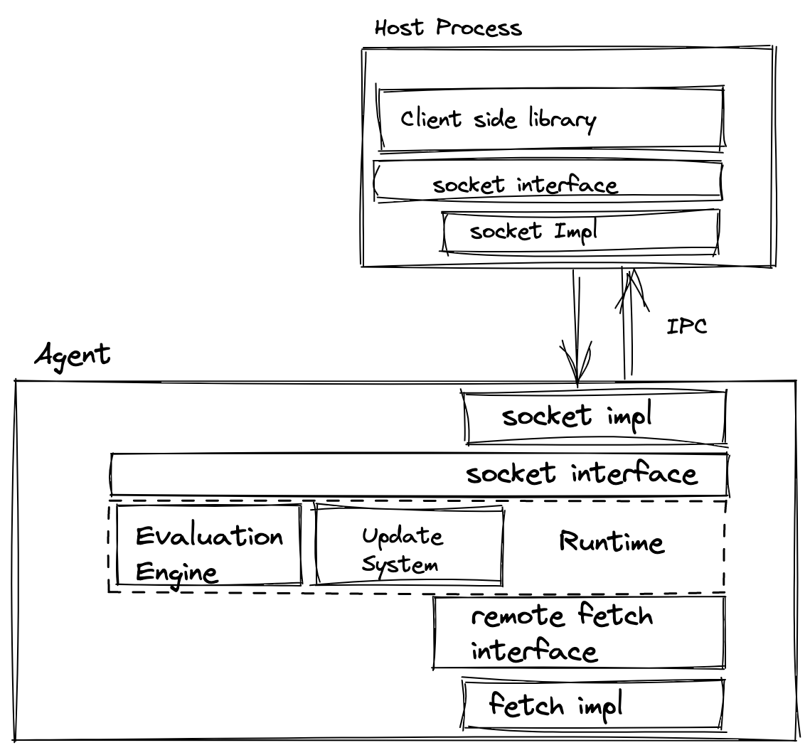

# 001-OFEP-cloud-native-pattern

## State: APPROVED

Hello folks,

I wanted to share some thoughts on an initial architectural design for the open feature project from the Kubernetes layer.
From my initial engagement and involvement with the group, this will be primarily focused on the server-side capability of presenting feature flags to container workloads.

## Assumptions

We initially assume that workloads will be some sort of web server, however, I would like to incorporate into the design the support of local AF_UNIX sockets for processes to manage their control flow based on external flags. To that end, we are also basing much of our overarching narrative on the ability to perform some sort of A/B testing; at this point not considering the use of flags to manage logic based on some sort of event activity - horizontal pod autoscaling as an example.

In my following example and illustrations, I have created the latter example of a flask based web server that is presented on the public internet. The flag system however is server-side and should not be programmable from the world wide web. At this time to me, it seems illogical to need to worry about RBAC/ACL and TLS concerns when making a highly sensitive API like this available to the public.

## Operator pattern

The typical Operator pattern in this context is appropriate over a stand-alone web service for the previously mentioned reasons but also because of the stateless and scalable nature of the design. For example; a multi-tenant environment is constrained by namespacing and service accounts; something which we would have to overcome if writing a centralised cluster-wide API.

In addition to this, there is a "feel" factor in using this pattern as it is easy to design, manage and augment.
I suggest that in conjunction with reconciliation on a primary custom resource, there is also the use of a mutating and validating admission webhook to enable key functionality.

## Workflow

In a nutshell, there are two types of a control flow for setting a feature flag.
Direct set and standing orders are the pet names for them in this illustration.

These combined should cover the majority of use cases and get the project into a rapidly usable state given they are fairly well-trodden patterns for interacting with services.




## Direct set

This pattern uses labels/annotations ( I am undecided currently as there are penalties on the size of the YAML file for storing large histories here ) directly for the open feature labelling system or a reference to an object that does; for example:

openfeature.io/standingorder: custom-resource-1
The key point here is that the deployment encapsulates where it wants to derive its feature flags from - this makes the issue of the owner referencing and mapping the configuration to the agent trivial.

Once a deployment has been configured with the appropriate annotations/labels then a cluster with OpenFeature Operator running will employ an optional namespace scoped set of webhooks.

validating admission webhook
The purpose of this webhook is to validate any inline JSON that has been configured with a manifest and to provide any additional context that needs to be encoded. This might well be appropriate in a multi-tenant environment to write remarks from an authoritative source.

For example:

openfeature.io/operator-remarks: namespaced, scoped, refreshable
mutating admission webhook
The job of this webhook is to run after the validating admission component and inject the OpenFeature agent into the configuration object and complete the required setup to present it to the host container ( the container running the desired workload for feature flagging ) within the pod.

This webhook will deal with configuration such as open port, transport type and configuration path locations ( possibly expanding to backing type such as PVC vs configmap ).

## Configuration reloading


In the scenario of a feature flag being altered, the configuration would be modified directly by the controller-manager and the agent would micro reload to present to the host container ( perhaps using the confd workflow ).

## Standing orders

This flow is supplementary to writing annotation directly to the deployment and can coexist within the same ecosystem.
The idea here is that you have a custom resource that can be programmable but might not necessarily be immediately associated with an application. It would be possible for an OpenFeature agent to fetch from a standing order custom resource rather than it's locally scoped configmap in this scenario.

This is important as it gives a known and persistent custom resource for programming feature flag states but also encourages a subscribe mechanic from a deployment. It might look like the following:

openfeature.agent/standing-orders-resource: custom-resource-one"
openfeature.agent/standing-orders-resource-namespace: default"
An argument against an API server
I believe there was an initial idea to create a cluster-wide API server, which I would discourage.
The problems presented with RBAC/ACL/TLS and other features are not-intractable but they are secondary to wider architectural design issues. I have laid out a few here.

## High-scale stateful configuration management

Because having state kept in memory is just a bad idea, especially with many engineers attempting to program against the backend API for OpenFeature, my thinking is we would persist this into state files.

In a large cluster with a centralised server, the thinking is that the configuration state files would need to be persisted to disk, this isn't alone a problem but a single file would create a complex nested object construct which would scale inversely to the number of workloads using open feature flags. This could be compensated by distributing to a state file per workload but at the expense of complexity. Managing orphaned files and alternative formats then compound this issue.

## Security

All workloads requiring access to a centralised server will need both access to the kubernetes control plane, the API server and the host overlay network. There are also risks with turning off someone else's feature flags as discussed which means a lot of machinery around security needs to be built and managed here - how do we check service accounts are valid? How do we check the authority level? How do we map a service account to feature flag permissions?

As you can see this design is an invitation to reinvent the wheel.

## Performance

Network calls will increase as workloads increase.
Neither design ( operator vs api ) are immune to this, however, the distance of calls will be increasing across nodes on the host overlay network unless there is a separate tenant network for calls to the OpenFeature API server.

In addition, when the API server fails or restarts all calls will start timing out to it unless there is behaviour introduced into the agents ( which is completely possible ). However, the remark about a single point of failure holds true.


Let me know your thoughts


## Additional architecture


## Post Kubecon configuration 

We had a meet up at Kubecon that touched on a few key issues that have helped to improve and inform this design pattern.

## remote endpoint configuration

Given that we want to accommodate vendors and enable them within this ecosystem, we are going to introduce a concept that allows for the Flag Custom Resource to indicate the desire for a remote endpoint point. To that end, it will enable a completely new set of capabilities from the host vendor to interact at the pod level with processes for the cloud-native provider. It serves as a mechanism to instigate a remote fetch capability that would merge or override the local configuration within the custom resource.

It could possibly have some of these types of fields:
```
remoteFlagProvider:
  type: <implementation name> 
  strategy: merge
  credentials:
   secret: <secret name> 
Agent
```

## Integration points

In order to enable host containers to consume the sidecar then there should be multiple protocols to do so.
There was an initial proposal to incorporate the AF_LOCAL/AF_UNIX socket family and within that family, we should decide whether is a need to support SOCK_STREAM and SOCK_DGRAM, I would initially suggest only supporting SOCK_STREAM.
This would enable us to further layer HTTP protocol support on top where required.



## Flow
The below illustration has been updated also to reflect the current thinking around the initialisation flow of the flagging system.

That said there are some learnings from Istio and concerns around side car overhead - namely around upgrading and maintenance. As such it is worth exploring a pattern for rolling or upgrading sidecars, as the implication is that this will force a deployment rollout due to the change on the deployment object ( and other resource types sts/ds)

