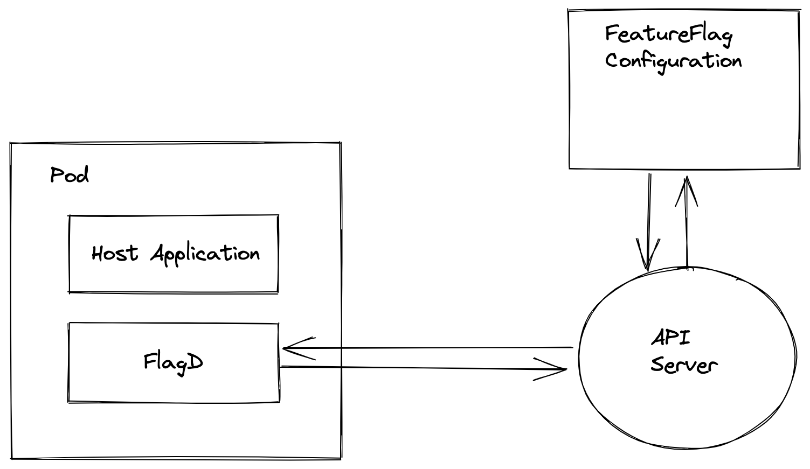
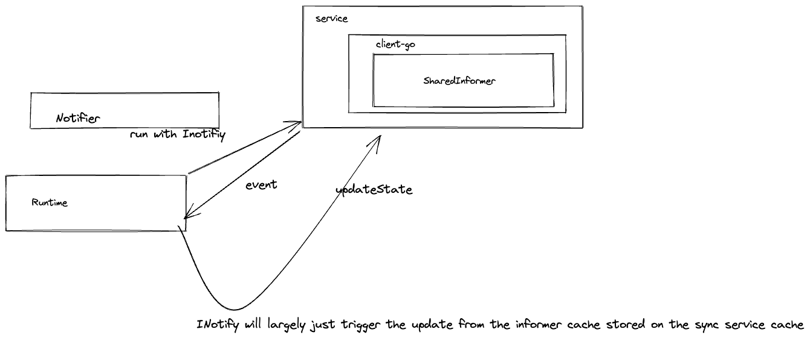

# 004-OFEP-inotfiy-interface

## State: APPROVED

FlagD is often used in the context of Kubernetes.

It is typically deployed by OFO as a companion sidecar and uses a volume injected via configmap as the source of its flags to evaluate.

I propose there may be a more optimal way to enable faster refreshing on flag changes by subscribing to a notifier against the Kubernetes API. This is inspired by this discussion with @therealmitchconnors and also the regression in being able to trigger configmap volume reloads through updating annotations within a deployment.

This is not a silverbullet and I think for academic purposes alone it is worth exploring if we would want to move in this direction.

~~The only real benefit here is speed of flag updates.~~

_Benefits to be discussed within this document_

## Design

FlagD would start with the typical arguments of flagd start --sync-service kubernetes.
This would use the token mounted from /var/run/secrets/kubernetes.io/serviceaccount to request to watch events for the FeatureFlagConfiguration. The FeatureFlagConfiguration could be determined by the pod getting its own annotations on start through the API and performing a look-up.


The current sync mechanics should be compatible with the 
```
type ISync interface {
	Fetch(ctx context.Context) (string, error)
	Notify(ctx context.Context, c chan<- INotify)
}
```


<!--  -->


### Realtime updates
- Shared informer factory will need to be extended to support the FeatureFlagConfiguration type through the restful API.
```
queue := workqueue.NewRateLimitingQueue(workqueue.DefaultControllerRateLimiter())
labelset := labels.Set(labelmap)
optionsModifier := func(options *meta_v1.ListOptions) {
    options.LabelSelector = labels.SelectorFromSet(labelset).String()
}

informer := config.InformerFactory.InformerFor(&batch_v1.Job{}, func(client kubernetes.Interface, resyncPeriod time.Duration) cache.SharedIndexInformer {
    return cache.NewSharedIndexInformer(
        cache.NewFilteredListWatchFromClient(client.BatchV1().RESTClient(), "featureflagconfigurations", namespace, optionsModifier),
        &batch_v1.Job{},
        resyncPeriod,
        cache.Indexers{cache.NamespaceIndex: cache.MetaNamespaceIndexFunc},
    )
})
```

I believe a _sharedinformer_ might be appropriate over indexed, unless we're looping over all the featureflagconfigurations in the cluster and they list in their hundreds.

<!--  -->


## Benefits

- Near real-time updates to flags as described within a Custom resource
- Lays foundation for watching of specific flagD feature configuration types _as per previous issue discussions_

## Caveats
- Creates a deep reference to Open feature operator
- Requires the design of failures modes for deletion of custom resources.
- Additional load on the API Server
- tightly couple FlagD to the Kubernetes golang bindings and limit multi-arch compatibility
